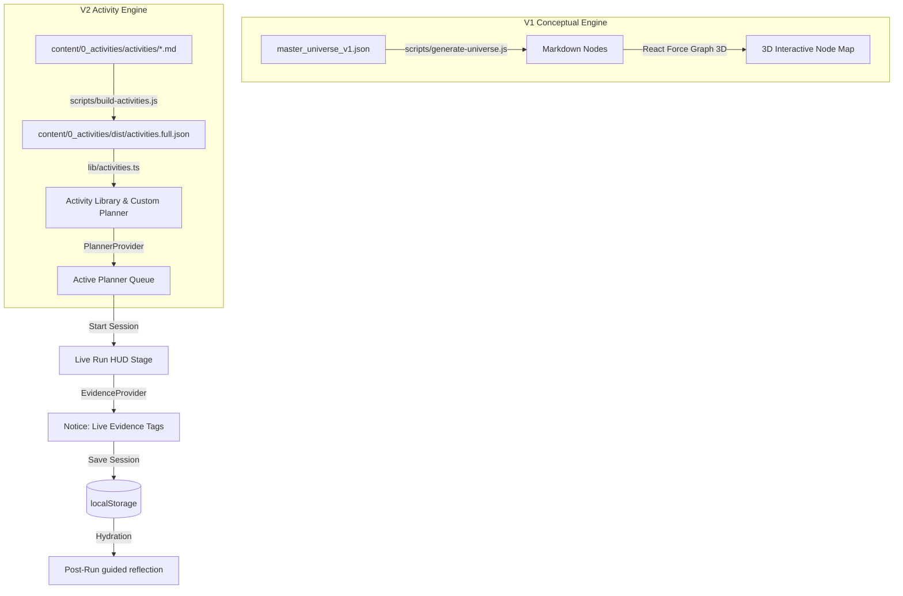

# SOURCE OF TRUTH // CURIOSITY OS

> **Project Identity:** Curiosity OS // Digital Laboratory & Classroom Operating System
> **Lead Engineer & Owner:** Tharun Gajula
> **Release Target:** Classroom Facilitation Suite 2.0 (Dual-Architecture)

---

## 1. Project Name & Description
**Curiosity OS** is a premium, client-side digital laboratory and interactive classroom facilitation utility designed specifically for Class 9–10 educators in India. It empowers teachers to orchestrate scientifically rigorous interactive lessons by running structured pedagogical activities, tracking student cognitive milestones, capturing live observations, and guiding classroom adaptation based on pedagogical data.

---

## 2. Purpose & Problem Space
Traditional Indian high-school classrooms (Grades 9–10) are heavily constrained by rote-memorization regimes and static lecture paradigms. **Curiosity OS** breaks this cycle by providing an interface that operates as a **Teacher Operating System** to:
- **Eradicate Rote Learning:** Shifting from absolute factual recall to active observation, causal reasoning, and error debugging.
- **Enable Classroom Orchestration:** Empowering teachers to manage active multi-stage exercises (labs, games, roleplay) with real-time timers and scaffolding tools.
- **Support Evidence-Driven Teaching:** Providing a high-contrast HUD for tracking active evidence tagging of student behaviors (e.g., breakthroughs, participation dips, useful disagreements) to guide immediate adaptations.
- **Support Professional Adaptation:** Building teacher capability via historical pedagogical reflection, letting teachers adapt curriculum templates to their local classroom reality.

---

## 3. Technology Stack & Precise Locked Versions
Curiosity OS is engineered to strictly prevent Next.js/React peer dependency issues and Turbopack compiler memory overhead. Do not upgrade these dependencies as they are hard-locked for local environment stability:

### 3.1. Core Framework
- **Next.js:** `16.1.6` (Utilizing the App Router paradigm)
- **React:** `19.2.3`
- **React DOM:** `19.2.3`
- **TypeScript:** `^5`

### 3.2. Styling & Layout
- **Tailwind CSS:** `^4.0.0`
- **PostCSS:** via `@tailwindcss/postcss` (`^4.0.0`)
- **Utility Classes:** `clsx` (`^2.1.1`), `tailwind-merge` (`^3.5.0`)
- **Fonts:** `Outfit` (Primary Display Sans) & `JetBrains Mono` (Terminal Core Interface Mono)

### 3.3. Content & Markdown Engine
- **Gray-Matter:** `^4.0.3` (YAML frontmatter parsing)
- **React Markdown:** `^10.1.0` (Render raw MD activity bodies)
- **Remark GFM:** `^4.0.1` (GitHub Flavored Markdown parsing extension)

### 3.4. 3D Visualizer & Physics Space (Legacy V1 Support)
- **Three.js:** `^0.183.1` (Core 3D engine)
- **React Three Fiber:** `^9.5.0` (R3F renderer context)
- **React Three Drei:** `^10.7.7` (R3F helper components)
- **Framer Motion 3D:** `^12.4.13` (3D motion physics transitions)
- **React Force Graph 3D:** `^1.29.1` (Highly interactive WebGL 3D network graphing component)
- **Three SpriteText:** `^1.10.0` (Vector typography within 3D Space)
- **Framer Motion:** `^12.34.3` (Dynamic 2D panel animations)

### 3.5. Typography & Asset Libraries
- **Lucide React:** `^0.575.0` (Scientific and workflow indicator iconography)

---

## 4. Zero-Knowledge Setup & Operational Commands
Curiosity OS runs as a zero-database, serverless, client-side React client. All session history is securely persisted inside the teacher's browser memory block.

### 4.1. Prerequisites
- **Node.js:** Active LTS version (`v18.x`, `v20.x`, or `v22.x`). Recommend `v20.x` for local parity.
- **Package Manager:** `npm` (included with Node).

### 4.2. Clean Install Flow
1. Clone or unpack the project files into the root workspace folder:
   `d:\000_before portfolio_10526\1_Product Lab Portfolio\curiosity-os\curiosity-os`
2. Clear any old node packages and build cache if resetting the system:
   ```bash
   rmdir /s /q node_modules
   rmdir /s /q .next
   ```
3. Run NPM install to lock dependency packages:
   ```bash
   npm install
   ```

### 4.3. Compilation & Build Scripts
The application features local builder pipelines that parse raw Markdown activity source files into optimized static client-side JSON files. Run these in sequence before executing the development server:

- **Generate Activity Indexes:**
  Parses raw activities under `/content/0_activities/activities/*.md` into JSON indices inside `/content/0_activities/dist/`.
  ```bash
  npm run build:activities
  ```
- **Validate Content Schema Compliance:**
  Validates required gray-matter keys and enum mappings in markdown activities to prevent runtime layout breaks.
  ```bash
  npm run validate:activities
  ```
- **Sync Neural Universe Markdown Nodes:**
  Converts master JSON structures into flat markdown pages for WikiLink node traversal inside the legacy 3D universe.
  ```bash
  npm run generate:universe
  ```
- **Generate Unified Textbook Guide (Development Tool):**
  Merges active universes into a single textbook master markdown file.
  ```bash
  npm run generate-textbook
  ```

### 4.4. Running the Dev Server
To start local hot-reloading:
```bash
npm run dev
```
The application will launch on: [http://localhost:3000](http://localhost:3000).

### 4.5. Production Bundling & Testing
Verify build compliance and static page optimization:
```bash
npm run build
npm run start
```

---

## 5. System Architecture
Curiosity OS incorporates a decoupled dual-architecture that integrates the conceptual knowledge model (V1) with the real-time pedagogical execution engine (V2).



### 5.1. Dual Architecture Components
1. **Legacy V1 Neural Universe (Semantic Knowledge Graph):**
   A conceptual network mapping 147 learning nodes and 381 semantic links across 4 operational Wings (*Decode, Cognition, Relate, Sandbox*). Used to browse subject clusters.
2. **V2 Interactive Facilitation Loop (Teacher Orchestrator):**
   Shifted primary focus to a practical 6-stage loops system focused on classroom orchestration:
   - **Browse:** Access the activity index to find targeted learning playbooks.
   - **Plan:** Select activities into a localized "planner queue" for immediate use.
   - **Run:** Launch a multi-step activity containing structural countdown timers, script slides, and active prompts.
   - **Notice:** Trigger real-time evidence tags (e.g., breakthrough, social friction) directly mapped to pedagogical goals.
   - **Reflect:** Guides teachers through guided reflections immediately after class.
   - **Adapt:** Creates memory logs of local adaptations, helping teachers build confidence in tailoring content.

---

## 6. Workspace File & Directory Structure

```
curiosity-os/
├── app/                            # Next.js 16 App Router pages
│   ├── globals.css                 # Base stylesheet containing Tailwind 4.0 variables
│   ├── layout.tsx                  # Root Next.js layout setting fonts, BottomDock & providers
│   ├── page.tsx                    # Landing dashboard (Browse & Plan entrance)
│   ├── activities/
│   │   ├── page.tsx                # Curation Playbook (Library View)
│   │   └── [slug]/
│   │       ├── page.tsx            # Activity Details & Adaptation view
│   │       ├── run/
│   │       │   └── page.tsx        # Active Session HUD (Run & Notice loop)
│   │       └── runs/
│   │           └── [sessionId]/
│   │               └── reflect/
│   │                   └── page.tsx # Guided Teacher Post-Run Reflection
│   ├── legacy/                     # Retained routes supporting V1 Neural Maps
│   │   └── gateway/                # Manifesto route for 3D exploration
│   └── planner/
│       └── page.tsx                # Class Session Planner View (Queue & Week tracker)
├── components/                     # Shared React UI components
│   ├── BottomBar.tsx               # Minimal, glassmorphic dock menu navigation bar
│   ├── ThemeToggle.tsx             # Theme utilities
│   └── ui/                         # Clean, atomic ui elements (buttons, badges)
├── content/                        # Static Curriculums and Active Activity Markdown Playbooks
│   ├── 0_activities/
│   │   ├── activities/             # 36 Live playbooks (Markdown with Gray-Matter)
│   │   ├── collections/            # Grouped activity pathways (MD files)
│   │   ├── dist/                   # Output of content compilation pipelines (JSON index files)
│   │   ├── enums/                  # activity-enums.ts containing category definitions
│   │   ├── schemas/                # activity-metadata.ts validating content shape
│   │   └── templates/              # activity-pilot.md starter blueprint
│   ├── 0_base_files_v2/
│   │   └── deep-research-report.md # Multi-page pedagogical theory research document
│   └── 1_another_point_of_view/    # V1 Static JSON nodes, layouts & validation references
├── lib/                            # Application state contexts and data retrievers
│   ├── activities.ts               # Core utility parser loading playbooks from Markdown/JSON
│   ├── evidence-context.tsx        # Provider tracking live tags, session status & localStorage
│   ├── planner-context.tsx         # Provider handling queue lists, sequence maps & bookmarks
│   └── utils.ts                    # Class-name merger
├── scripts/                        # Automation & builder utilities
│   ├── build-activities.js         # MD -> Optimized JSON indexer script
│   ├── generate-textbook.js        # Compiles textbook markdown reference sheets
│   ├── generate-universe.js        # Synthesizes JSON node clusters into MD assets
│   └── validate-activities.js      # Robust content checks for the 36-flagship activities
├── package.json                    # Project locked configurations and scripts
├── postcss.config.mjs              # PostCSS setup mapping Tailwind
├── tailwind.config.ts              # Local styling adjustments
└── tsconfig.json                   # TypeScript base rules configuration
```

---

## 7. Features & Classroom Facilitation Loop
The application centers around the daily workflow of active teaching:

### 7.1. Curation Library (Browse & Plan)
- **Library View (`/activities`):** Allows teachers to search and filter the 36 flagship activities by category (*Reality Check, Study Engine, Decision Gym, Truth & Evidence, Systems Lens, People & Pressure, Trust & Teamwork, Reset & Reflect, Sandbox*), prep levels (*No Prep, Low Prep, High Prep*), group mode (*Solo, Pairs, Small Group, Whole Class*), duration, and targeted evidence dimensions.
- **Sequence Planner (`/planner`):** An interactive scheduling space where teachers can add/remove activities to their active Queue ("This Week") or create custom learning sequences for specific groups.

### 7.2. Active Live Run HUD (`/activities/[slug]/run`)
- **Countdown Timer Dashboard:** Guides teachers through specific steps mapped under `flow_steps` (e.g. 5m Setup → 15m Simulation → 10m Debrief). It features clean soundless flash cues.
- **Step Scaffolding Sheets:** Displays immediate instructions ("Teacher Moves" and "Common Failure Points") for each step.
- **Evidence Tagging Terminal (Notice Phase):** Allows the teacher to click on-the-fly evidence tag buttons (e.g. `Strong Reasoning`, `Confusion`, `Thoughtful Question`, `Social Friction`) during dynamic classroom play. The interface writes the action down along with the step index and exact millisecond timestamp.

### 7.3. Guided Reflection Workspace (`/activities/[slug]/runs/[sessionId]/reflect`)
- **Evidence Timeline:** Renders a list of all observations tagged during the run, showing precisely *when* and *in what step* they occurred.
- **Structured Reflection Inputs:** Prompts the teacher to answer specific prompts: *What worked well? Where did student reasoning struggle? What local adaptations will you make next time?*
- **Pedagogical Actions:** Prompts selection of followup actions (*Rerun with adaptation*, *Move to follow-up activity*, *Schedule later*).

---

## 8. Data Shapes, Content Schemas, and State APIs

### 8.1. Markdown Activity Structure (Gray-Matter Schema)
Every activity inside `/content/0_activities/activities/` must match this exact shape verified by `scripts/validate-activities.js`:

```yaml
---
id: "cos2_a28"                                # Unique serial code
slug: "listening-lab-paraphrase-clarify-confirm" # URL slug
title: "Listening Lab: Paraphrase, Clarify, Confirm" # UI Header
short_promise: "Practice active validation techniques under noise."
teacher_value_line: "Train students to prevent conversational drift."
student_value_line: "Learn to summarize arguments before disputing them."
summary: "A rapid pairs exercise to practice high-fidelity communication."
purpose_category: "People & Pressure"          # Mapped to strict enums
mode_category: "Simulation / Roleplay"        # Mapped to strict enums
class_fit:
  grades: [9, 10]
  typical_class_size: "30-40"
duration_minutes:
  min: 25
  typical: 30
  max: 40
group_mode: "Pairs"
prep_level: "No Prep"
materials:
  minimal: ["Timer"]
energy_level: "High"
facilitation_difficulty: 2
flow_steps:
  - t: 5
    step: "Setup & Alignment"
  - t: 15
    step: "Pairs Execution Exchange"
  - t: 10
    step: "Whole Class Reflection"
teacher_moves:
  - "Introduce noisy environment parameters."
teacher_watch_fors:
  - "Watch for students jumping straight to disagreement."
observation_cues:
  - "Observe if pairs can replay arguments without changing tone."
common_failure_points:
  - "Conversations collapse into arguments."
reflection_prompts:
  - "How did paraphrasing shift your immediate response?"
adaptations:
  large_class: "Run in structured rows."
follow_ups: ["cos2_a25"]
status: "flagship"
curation_tier: "flagship_36"
version: "2.0"
internal:
  backend_primary_wing: "Relate"
  backend_capability_clusters: ["trust_boundaries_pressure"]
  evidence_dimensions_targeted: ["transfer", "reflect"]
---
```

### 8.2. Evidence State Context API (`lib/evidence-context.tsx`)
Manages live run recording and browser persistence:

#### Core Types
```typescript
export type EvidenceType = 'observation' | 'confusion' | 'quote' | 'breakthrough' | 'participation' | 'next_step' | 'reflection';

export interface EvidenceEntry {
  id: string;          // Format: entry_{timestamp}
  sessionId: string;   // Reference to current active session
  activityId: string;  // Reference to activity id
  stepIndex: number;   // Flow step index where tagged
  timestamp: number;   // Date.now() timestamp
  type: EvidenceType;
  note: string;
  tags: string[];
}

export interface Session {
  id: string;          // Format: session_{timestamp}
  activityId: string;
  activityTitle: string;
  startTime: number;
  endTime?: number;
  status: 'active' | 'completed';
  reflection?: string;
  whatWorked?: string;
  whereStruggled?: string;
  adaptationNotes?: string;
  nextStepChoice?: 'rerun' | 'followup' | 'later';
  nextStepActivityId?: string;
}
```

#### Context Interface Methods
- `startSession(activityId, activityTitle): string` - Initialise an active session in local storage.
- `endSession(sessionId, reflection?)` - Finalize the session, stamping the current time.
- `updateSession(sessionId, updates)` - Performs dynamic partial edits to custom parameters.
- `addEntry(entryData)` - Appends a structured observation directly to the live event log.
- `deleteEntry(entryId)` - Removes an entry from the timeline.
- `getEntriesForSession(sessionId)` - Queries all live tags associated with a run.
- `getActiveSession()` - Fetches the currently running session parameters.

---

## 9. Design System & UI Specifications

Curiosity OS implements a highly stylized digital laboratory design system built directly on Tailwind CSS v4.0. It prioritizes dark aesthetics, neon contrast markers, and rapid tactile feedback.

### 9.1. Color System (Tailwind `@theme`)
- **Background:** `#030712` (Deep Space / Deep Void)
- **Foreground Text:** `#F8FAFC` (High-contrast Slate)
- **Primary Contrast Highlight:** Electric Cyan (`#00F0FF`)
- **Secondary Interaction Accent:** Deep Azure (`#0055FF`)
- **System Indicator Palettes:**
  - Success Green: `#10B981`
  - System Warning Gold: `#F59E0B`
  - System Error Crimson: `#EF4444`

### 9.2. Typography
- **Headings & Cards (Outfit):** Modern display sans serif.
- **Numbers, Logs & Timers (JetBrains Mono):** Monospaced type for grid layouts, data points, status trackers, and timers.

### 9.3. Animations (CSS & Framer Motion)
- **Ring Expansion:** `@keyframes ring-expand` maps pulsing neon ripples for active running states.
- **Shimmer Button Sweep:** Radial gradients that move across interactive headers.
- **UI Navigation (BottomDock):** Glassmorphic horizontal bar locked to the screen base (`fixed bottom-4 z-[150]`), offering clear transition effects.

---

## 10. External Services, APIs, and Keys
**Curiosity OS runs 100% locally.**
- **No external API keys** (e.g., Stripe, Firebase, Supabase) are utilized or needed.
- **No Database connections** are established.
- All dynamic actions and session observations rely exclusively on browser **`localStorage`** using the keys:
  - `curiosity_os_planner_v1` (Queue and saved sequence models)
  - `curiosity_os_evidence_v1` (Active session metrics and teacher reflections)

This complete client-side sandboxing guarantees instantaneous load speeds in schools with poor connectivity and ensures 100% data privacy for student observation tags.

---

## 11. Engineering Decisions & Design Rationale

### 11.1. Decoupled Dual-Architecture Shifting
- **Reasoning:** Phase 1 was built entirely around a complex 3D network graph mapping 147 abstract conceptual nodes. While visually stunning, classroom testing proved it was too theoretical for teacher lesson prep. Phase 2 introduced a structured **Workflows System** (Browse → Plan → Run → Notice → Reflect → Adapt). The legacy 3D universe is retained as an interactive "gateway concept library" at `/legacy/gateway`, while the primary workflow remains focused on practical tools.

### 11.2. Client-Side Browser Storage Model
- **Reasoning:** Indian classrooms frequently experience weak or intermittent network connections. Relying on remote databases (like Firebase or Supabase) risked freezing during live sessions. Persisting all data to local storage ensures zero latency, high reliability, and a completely zero-maintenance backend architecture.

### 11.3. Strict Locked React & Next Versions
- **Reasoning:** In earlier iterations, upgrading dependencies broke WebGL integration on React 19 or triggered Turbopack compilation memory leaks on Next 16. The dependencies are locked at Next `16.1.6` and React `19.2.3` to ensure compilation speed, WebGL performance in R3F, and hot-reload stability on developer computers.

### 11.4. Pivot of Activity `cos2_a28`
- **Reasoning:** The activity originally named "Red Flag Detective" focused on spotting controversial logical anomalies. To ensure classroom safety, it was evolved into **"Listening Lab: Paraphrase, Clarify, Confirm"**, which focuses on active validation, high-fidelity message transmission, and conversational clarity.

---

## 12. Known Gotchas, Potential Gotchas, and Roadmap

- **Browser Storage Deletions:** Because state resides exclusively in `localStorage`, clearing browser cache or cookies will wipe all evidence logs and sequence planners.
- **JSON Output Mismatch:** If modifications are made to `/content/0_activities/activities/*.md`, the changes will not render in the UI until `npm run build:activities` is executed.
- **WebGL Frame Drops:** In the legacy 3D map (`/legacy/gateway`), low-spec classroom laptops may experience lag. A warning and simple list mode are provided as fallback measures.

---

## 13. Step-by-Step, Beginner-Proof Reconstruction Checklist

Follow this checklist exactly to rebuild Curiosity OS from absolute scratch on a clean system:

### Phase 1: Environment & Directory Setup
- [ ] **1.** Install Node.js LTS (`v20.x`) and verify terminal access (`node -v` and `npm -v`).
- [ ] **2.** Create the directory `curiosity-os` and initialize the project:
  ```bash
  mkdir curiosity-os
  cd curiosity-os
  npm init -y
  ```
- [ ] **3.** Create the core sub-folders using terminal scripts:
  ```bash
  mkdir app components content lib scripts
  mkdir content\0_activities content\0_activities\activities content\0_activities\collections content\0_activities\enums content\0_activities\schemas content\0_activities\templates content\0_base_files_v2 content\1_another_point_of_view
  ```

### Phase 2: Configuration & Version Locks
- [ ] **4.** Paste the exact locked specifications into `package.json` dependencies and devDependencies:
  ```json
  "dependencies": {
    "@react-three/drei": "^10.7.7",
    "@react-three/fiber": "^9.5.0",
    "clsx": "^2.1.1",
    "framer-motion": "^12.34.3",
    "framer-motion-3d": "^12.4.13",
    "gray-matter": "^4.0.3",
    "lucide-react": "^0.575.0",
    "next": "16.1.6",
    "react": "19.2.3",
    "react-dom": "19.2.3",
    "react-force-graph-3d": "^1.29.1",
    "react-markdown": "^10.1.0",
    "remark-gfm": "^4.0.1",
    "tailwind-merge": "^3.5.0",
    "three": "^0.183.1",
    "three-spritetext": "^1.10.0"
  },
  "devDependencies": {
    "@eslint/eslintrc": "^3.3.0",
    "@tailwindcss/postcss": "^4",
    "@types/node": "^20",
    "@types/react": "^19",
    "@types/react-dom": "^19",
    "eslint": "^9",
    "eslint-config-next": "16.1.6",
    "tailwindcss": "^4",
    "typescript": "^5"
  }
  ```
- [ ] **5.** Add the exact compilation commands under `scripts` in `package.json`:
  ```json
  "scripts": {
    "dev": "next dev",
    "build": "next build",
    "start": "next start",
    "lint": "eslint",
    "generate:universe": "node scripts/generate-universe.js",
    "validate:activities": "node scripts/validate-activities.js",
    "build:activities": "node scripts/build-activities.js"
  }
  ```
- [ ] **6.** Run `npm install` to populate `node_modules` according to the version locks.
- [ ] **7.** Create `tsconfig.json` at the root and config Next aliases.

### Phase 3: Foundations & Styles
- [ ] **8.** Build `app/globals.css` with the Tailwind v4 custom theme and deep space variables:
  ```css
  @import "tailwindcss";
  @theme inline {
    --color-electric-cyan: #00F0FF;
    --color-deep-azure: #0055FF;
    --color-sys-success: #10B981;
    --color-sys-warning: #F59E0B;
    --color-sys-error: #EF4444;
    --font-mono: var(--font-jetbrains-mono);
  }
  :root {
    --background: #030712;
    --foreground: #f8fafc;
  }
  body {
    background-color: var(--background);
    color: var(--foreground);
    font-family: var(--font-jetbrains-mono), monospace;
  }
  ```

### Phase 4: State Providers
- [ ] **9.** Implement `lib/planner-context.tsx` with queue management, sequences, and local storage state hydration (`curiosity_os_planner_v1`).
- [ ] **10.** Implement `lib/evidence-context.tsx` with session controls, event tagging, and local storage hydration (`curiosity_os_evidence_v1`).
- [ ] **11.** Create the global layout in `app/layout.tsx`, nesting child components inside `PlannerProvider` and `EvidenceProvider`.

### Phase 5: Content Compiler Utilities
- [ ] **12.** Write `scripts/build-activities.js` to index the `/content/0_activities/activities/*.md` directory.
- [ ] **13.** Write `scripts/validate-activities.js` to ensure metadata integrity across playbooks.
- [ ] **14.** Write `lib/activities.ts` to parse markdown content, parse gray-matter headers, and handle fallback routines if compiled JSON is absent.

### Phase 6: Pages & Views
- [ ] **15.** Implement the Interactive Dashboard page (`app/page.tsx`).
- [ ] **16.** Create the Playbook Curation view (`app/activities/page.tsx`).
- [ ] **17.** Build the Active Session HUD (`app/activities/[slug]/run/page.tsx`) mapping structural timers,Moves/Watch-fors, and evidence buttons.
- [ ] **18.** Build the guided review layout (`app/activities/[slug]/runs/[sessionId]/reflect/page.tsx`) rendering marked observations and adaptation logs.
- [ ] **19.** Copy the static assets and activity markdown files into the `content` folder.
- [ ] **20.** Execute index builder commands:
  ```bash
  npm run build:activities
  npm run validate:activities
  ```
- [ ] **21.** Launch development mode (`npm run dev`) and open [http://localhost:3000](http://localhost:3000) to verify!
