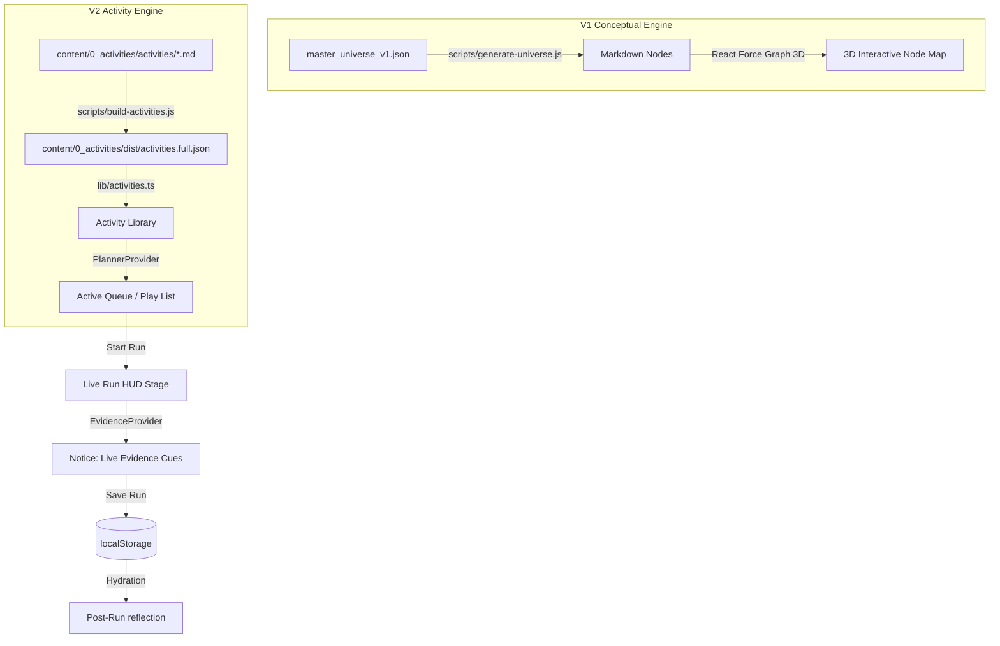

# SOURCE OF TRUTH // CURIOSITY OS

> **Project Identity:** Curiosity OS // Open Learning Exploration System
> **Lead Engineer & Owner:** Tharun Gajula
> **Release Target:** Static Open Learning Exploration System (Dual-Architecture)

---

## 1. Project Name & Description
**Curiosity OS** is a premium, client-side open learning exploration system designed by Tharun Gajula. It helps students, teachers, parents, and curious learners train their curiosity, questioning, observation, reasoning, discussion, and self-learning through an interactive visual knowledge universe (**Curiosity Verse**) and a practical activity playbooks library.

---

## 2. Purpose & Problem Space
Curiosity OS shifts the learning experience from rote memorization and classroom compliance into active, self-driven inquiry. It is optimized as a free, open, and static web platform that provides:
- **Curiosity Verse:** A visual map of concepts to help learners wander, connect ideas, and see knowledge from multiple points of view.
- **Activity Library:** Free and open playbooks (Reality Checks, Study Engines, Decision Gyms, Trust & Teamwork) that anyone can run individually or in small groups to build practical thinking habits.
- **Scaffolding for Guides:** Dynamic HUD steps, timers, and "Notice & Capture" tools allowing mentors, parents, or group guides to facilitate collaborative thought exercises seamlessly.
- **Zero-Friction Accessibility:** Runs fully client-side with no logins, database overhead, or progress tracking, ensuring data privacy and offline accessibility in high-latency environments.

---

## 3. Technology Stack & Precise Locked Versions
Curiosity OS is engineered to strictly prevent Next.js/React peer dependency issues and Turbopack compiler memory overhead. Do not upgrade these dependencies as they are hard-locked for local environment stability:

### 3.1. Core Framework
- **Next.js:** `16.1.6` (Utilizing the App Router paradigm)
- **React:** `19.2.3`
- **React DOM:** `19.2.3`
- **TypeScript:** `^5`

### 3.2. Styling & Layout
- **Tailwind CSS:** `^4.0.0`
- **PostCSS:** via `@tailwindcss/postcss` (`^4.0.0`)
- **Utility Classes:** `clsx` (`^2.1.1`), `tailwind-merge` (`^3.5.0`)
- **Fonts:** `Outfit` (Primary Display Sans) & `JetBrains Mono` (Terminal Core Interface Mono)

### 3.3. Content & Markdown Engine
- **Gray-Matter:** `^4.0.3` (YAML frontmatter parsing)
- **React Markdown:** `^10.1.0` (Render raw MD activity bodies)
- **Remark GFM:** `^4.0.1` (GitHub Flavored Markdown parsing extension)

### 3.4. 3D Visualizer & Physics Space (Curiosity Verse Map)
- **Three.js:** `^0.183.1` (Core 3D engine)
- **React Three Fiber:** `^9.5.0` (R3F renderer context)
- **React Three Drei:** `^10.7.7` (R3F helper components)
- **Framer Motion 3D:** `^12.4.13` (3D motion physics transitions)
- **React Force Graph 3D:** `^1.29.1` (Highly interactive WebGL 3D network graphing component)
- **Three SpriteText:** `^1.10.0` (Vector typography within 3D Space)
- **Framer Motion:** `^12.34.3` (Dynamic 2D panel animations)

### 3.5. Typography & Asset Libraries
- **Lucide React:** `^0.575.0` (Scientific and workflow indicator iconography)

---

## 4. Zero-Knowledge Setup & Operational Commands
Curiosity OS runs as a zero-database, serverless, client-side React app. All session history is securely persisted inside the user's browser memory block via `localStorage`.

### 4.1. Prerequisites
- **Node.js:** Active LTS version (`v18.x`, `v20.x`, or `v22.x`). Recommend `v20.x` for local parity.
- **Package Manager:** `npm` (included with Node).

### 4.2. Clean Install Flow
1. Clone or unpack the project files into the root workspace folder:
   `d:\000_before portfolio_10526\1_Product Lab Portfolio\curiosity-os\curiosity-os`
2. Clear any old node packages and build cache if resetting the system:
   ```bash
   rmdir /s /q node_modules
   rmdir /s /q .next
   ```
3. Run NPM install to lock dependency packages:
   ```bash
   npm install
   ```

### 4.3. Compilation & Build Scripts
The application features local builder pipelines that parse raw Markdown activity source files into optimized static client-side JSON files. Run these in sequence before executing the development server:

- **Generate Activity Indexes:**
   Parses raw activities under `/content/0_activities/activities/*.md` into JSON indices inside `/content/0_activities/dist/`.
   ```bash
   npm run build:activities
   ```
- **Validate Content Schema Compliance:**
   Validates required gray-matter keys and enum mappings in markdown activities to prevent runtime layout breaks.
   ```bash
   npm run validate:activities
   ```
- **Sync Neural Universe Markdown Nodes:**
   Converts master JSON structures into flat markdown pages for WikiLink node traversal inside the legacy 3D universe.
   ```bash
   npm run generate:universe
   ```
- **Generate Unified Textbook Guide (Development Tool):**
   Merges active universes into a single textbook master markdown file.
   ```bash
   npm run generate-textbook
   ```

### 4.4. Running the Dev Server
To start local hot-reloading:
```bash
npm run dev
```
The application will launch on: [http://localhost:3000](http://localhost:3000).

### 4.5. Production Bundling & Testing
Verify build compliance and static page optimization:
```bash
npm run build
npm run start
```

---

## 5. System Architecture
Curiosity OS integrates the conceptual knowledge model (V1 Curiosity Verse) with a practical active learning facilitation engine.



### 5.1. Dual Architecture Components
1. **Curiosity Verse 3D Engine (Knowledge Graph):**
   An immersive interactive graph mapping 147 learning nodes and 381 semantic links across 4 operational Wings (*Decode, Cognition, Relate, Sandbox*). Accessible at `/another_point_of_view` and `/verse`.
2. **Interactive Activity System:**
   Allows individuals and guides to run exercises step-by-step using a tactile interface:
   - **Browse:** Access the activity index to find targeted playbooks.
   - **Plan:** Select activities into a localized session queue ("Planner") for immediate access.
   - **Run:** Launch a multi-step activity containing countdown timers and facilitate active discussion prompts.
   - **Notice:** Note observations (e.g. breakthroughs, confusion, disagreements) with live timestamped tags.
   - **Reflect:** Guide reflection questions at the end of an activity to lock in thinking progress.

---

## 6. Workspace File & Directory Structure

```
curiosity-os/
├── app/                            # Next.js 16 App Router pages
│   ├── globals.css                 # Base stylesheet containing Tailwind 4.0 variables
│   ├── layout.tsx                  # Root Next.js layout setting fonts, BottomDock & providers
│   ├── page.tsx                    # Landing dashboard / Main Portal
│   ├── activities/
│   │   ├── page.tsx                # Playbook Curation Library
│   │   └── [slug]/
│   │       ├── page.tsx            # Activity Details & Adaptation parameters
│   │       ├── run/
│   │       │   └── page.tsx        # Active Session HUD (Step Timers & Notice cues)
│   │       └── runs/
│   │           └── [sessionId]/
│   │               └── reflect/
│   │                   └── page.tsx # Interactive Guided Reflection
│   ├── another_point_of_view/
│   │   └── page.tsx                # Core 3D Interactive WebGL Graph Canvas (Curiosity Verse)
│   ├── gateway/
│   │   └── page.tsx                # Gateway: 'Start Here' guide & entry portal
│   ├── paths/
│   │   └── page.tsx                # Learning Paths (Structured exploration journeys)
│   ├── planner/
│   │   └── page.tsx                # Activity Sequence Planner View (Queue & Week tracker)
│   └── verse/
│       └── page.tsx                # Curiosity Verse landing and gateway portal
├── components/                     # Shared React UI components
│   ├── BottomBar.tsx               # Floating, glassmorphic bottom navigation dock (ACTIVITIES, HOME, VERSE)
│   ├── ThemeToggle.tsx             # Theme utilities
│   └── ui/                         # Atomic, high-fidelity UI badges, buttons, cards
├── content/                        # Markdown Playbooks & Static Curriculums
│   ├── 0_activities/
│   │   ├── activities/             # 36 Flagship markdown playbook files
│   │   ├── collections/            # Grouped category paths (MD format)
│   │   ├── dist/                   # Compiled outputs of MD build pipelines (JSON format)
│   │   ├── enums/                  # activity-enums.ts definitions
│   │   ├── schemas/                # activity-metadata.ts shape definition
│   │   └── templates/              # activity-pilot.md blueprint
│   ├── 0_base_files_v2/
│   │   └── deep-research-report.md # Pedagogical theory research manual
│   └── 1_another_point_of_view/    # V1 Conceptual JSON nodes & layouts
├── lib/                            # Application state contexts and utilities
│   ├── activities.ts               # Content parser loading Markdown files to memory
│   ├── evidence-context.tsx        # Context handling live timers, notice events, and reflection logs
│   ├── planner-context.tsx         # Context tracking planner queue structures
│   └── utils.ts                    # Class-name configuration merger
├── scripts/                        # Automation & builder utilities
│   ├── build-activities.js         # MD -> Optimized JSON indexer script
│   ├── generate-textbook.js        # Compiles textbook markdown reference sheets
│   ├── generate-universe.js        # Synthesizes JSON node clusters into MD assets
│   └── validate-activities.js      # Schema validator for playbooks
├── package.json                    # Project locked configurations and scripts
├── postcss.config.mjs              # PostCSS setup mapping Tailwind
├── tailwind.config.ts              # Local styling overrides
└── tsconfig.json                   # TypeScript compiler rules
```

---

## 7. Core Features & Active Learning Loop
The system revolves around three core interfaces supported by the floating bottom navigation bar:

### 7.1. Bottom Navigation Bar (`ACTIVITIES` // `HOME` // `VERSE`)
- **Left Tab (ACTIVITIES):** Routes to the curated [Activity Library](/activities). Uses the `BookOpen` icon.
- **Center Anchor (HOME):** Routes back to the main homepage dashboard (`/`). Uses a prominent, glowing cyan `Home` icon.
- **Right Tab (VERSE):** Routes to the [Curiosity Verse](/verse) portal for WebGL conceptual graph browsing. Uses the `Compass` icon.

### 7.2. Curation Library (`/activities` & `/paths`)
- **Categorized Playbooks:** Allows users to filter the 36 flagship activities by category (*Reality Check, Study Engine, Decision Gym, Truth & Evidence, Systems Lens, People & Pressure, Trust & Teamwork, Reset & Reflect, Sandbox*), prep levels (*No Prep, Low Prep, High Prep*), group mode (*Solo, Pairs, Small Group, Whole Class*), duration, and energy levels.
- **Learning Paths (`/paths`):** Structured journeys (e.g. "Systems & Signals", "Trust & Pressure") guiding learners through progressive playbooks to build specific thinking habits.

### 7.3. Step-by-Step Execution Mode (`/activities/[slug]/run`)
- **Countdown HUD Timer:** Features clear visual progress indicators for each facilitation step (e.g., Setup → Simulation → Reflection).
- **Tactical Toolbox:** Shows "Watch Fors", "Notice & Capture Cues", and "Teacher Moves" to aid anyone facilitating the exercise.
- **Evidence Tagging Terminal:** Facilitators or individuals can capture micro-observations on-the-fly (e.g., `Breakthrough`, `Confusion`, `Thoughtful Question`, `Social Friction`) with milliseconds accuracy.

---

## 8. Data Shapes, Content Schemas, and State APIs

### 8.1. Markdown Activity Structure (Gray-Matter Schema)
Every activity inside `/content/0_activities/activities/` must match this exact shape verified by `scripts/validate-activities.js`:

```yaml
---
id: "cos2_a28"                                # Unique serial code
slug: "listening-lab-paraphrase-clarify-confirm" # URL slug
title: "Listening Lab: Paraphrase, Clarify, Confirm" # UI Header
short_promise: "Practice active validation techniques under noise."
teacher_value_line: "Train students to prevent conversational drift."
student_value_line: "Learn to summarize arguments before disputing them."
summary: "A rapid pairs exercise to practice high-fidelity communication."
purpose_category: "People & Pressure"          # Mapped to strict enums
mode_category: "Simulation / Roleplay"        # Mapped to strict enums
class_fit:
  grades: [9, 10]
  typical_class_size: "30-40"
duration_minutes:
  min: 25
  typical: 30
  max: 40
group_mode: "Pairs"
prep_level: "No Prep"
materials:
  minimal: ["Timer"]
energy_level: "High"
facilitation_difficulty: 2
flow_steps:
  - t: 5
    step: "Setup & Alignment"
  - t: 15
    step: "Pairs Execution Exchange"
  - t: 10
    step: "Whole Class Reflection"
teacher_moves:
  - "Introduce noisy environment parameters."
teacher_watch_fors:
  - "Watch for students jumping straight to disagreement."
observation_cues:
  - "Observe if pairs can replay arguments without changing tone."
common_failure_points:
  - "Conversations collapse into arguments."
reflection_prompts:
  - "How did paraphrasing shift your immediate response?"
adaptations:
  large_class: "Run in structured rows."
follow_ups: ["cos2_a25"]
status: "flagship"
curation_tier: "flagship_36"
version: "2.0"
internal:
  backend_primary_wing: "Relate"
  backend_capability_clusters: ["trust_boundaries_pressure"]
  evidence_dimensions_targeted: ["transfer", "reflect"]
---
```

### 8.2. Evidence State Context API (`lib/evidence-context.tsx`)
Manages active sessions and local storage persistence:

#### Core Types
```typescript
export type EvidenceType = 'observation' | 'confusion' | 'quote' | 'breakthrough' | 'participation' | 'next_step' | 'reflection';

export interface EvidenceEntry {
  id: string;          // Format: entry_{timestamp}
  sessionId: string;   // Reference to current active session
  activityId: string;  // Reference to activity id
  stepIndex: number;   // Flow step index where tagged
  timestamp: number;   // Date.now() timestamp
  type: EvidenceType;
  note: string;
  tags: string[];
}

export interface Session {
  id: string;          // Format: session_{timestamp}
  activityId: string;
  activityTitle: string;
  startTime: number;
  endTime?: number;
  status: 'active' | 'completed';
  reflection?: string;
  whatWorked?: string;
  whereStruggled?: string;
  adaptationNotes?: string;
  nextStepChoice?: 'rerun' | 'followup' | 'later';
  nextStepActivityId?: string;
}
```

---

## 9. Design System & UI Specifications

Curiosity OS implements a highly stylized digital laboratory design system built directly on Tailwind CSS v4.0. It prioritizes dark aesthetics, neon contrast markers, and rapid tactile feedback.

### 9.1. Color System (Tailwind `@theme`)
- **Background:** `#030712` (Deep Space / Deep Void)
- **Foreground Text:** `#F8FAFC` (High-contrast Slate)
- **Primary Contrast Highlight:** Electric Cyan (`#00F0FF`)
- **Secondary Interaction Accent:** Deep Azure (`#0055FF`)
- **System Indicator Palettes:**
  - Success Green: `#10B981`
  - System Warning Gold: `#F59E0B`
  - System Error Crimson: `#EF4444`

### 9.2. Typography
- **Headings & Cards (Outfit):** Modern display sans serif.
- **Numbers, Logs & Timers (JetBrains Mono):** Monospaced type for grid layouts, data points, status trackers, and timers.

### 9.3. Animations (CSS & Framer Motion)
- **Ring Expansion:** `@keyframes ring-expand` maps pulsing neon ripples for active running states.
- **Shimmer Button Sweep:** Radial gradients that move across interactive headers.
- **Bottom Navigation Clearances:** Key content pages feature safety padding-bottom parameters (`pb-48` on `.min-h-screen` and `pb-16` / `pb-24` on nested container wrappers) to prevent layouts from being obscured by the bottom floating menu dock.

---

## 10. External Services, APIs, and Keys
**Curiosity OS runs 100% locally and serverless.**
- **No external API keys** are utilized or needed.
- **No Database connections** are established.
- All dynamic actions and session observations rely exclusively on browser **`localStorage`** using the keys:
  - `curiosity_os_planner_v1` (Queue and saved bookmarks)
  - `curiosity_os_evidence_v1` (Active session metrics and reflections)

This local-only client-side sandboxing guarantees immediate load speeds, complete offline functionality, and 100% data privacy for learners and facilitators.

---

## 11. Engineering Decisions & Rationale

### 11.1. Client-Side Browser Storage Model
- **Reasoning:** Classrooms and remote spaces experience weak or intermittent network connections. Relying on remote databases risked freezes during live activity sessions. Browser storage ensures instantaneous, latency-free, and high-reliability operations under all local conditions.

### 11.2. Strict Locked React & Next Versions
- **Reasoning:** WebGL integration with React Three Fiber (R3F) and interactive force graph canvases are highly sensitive to framework upgrades. Keeping Next `16.1.6` and React `19.2.3` guarantees 3D performance stability and prevents Turbopack compilation leaks during rapid developer reload sessions.

### 11.3. Surgical Shift to Open Static Portal
- **Reasoning:** By removing planning workflows from the primary floating dock and foregrounding the **Curiosity Verse** and **Activity Library**, Curiosity OS sheds its legacy classroom management skin. It has been transformed into a simple, beautiful, and completely free static web playground for anyone wishing to develop reasoning and exploration skills.

---

## 12. Known Gotchas & Troubleshooting

- **Browser Storage Clears:** Clearing cookies/local storage will clear all bookmarks, planner queues, and saved timeline reflection logs.
- **Index Generation:** Modifications to markdown playbooks in `/content/0_activities/activities/*.md` will not show up in browser views until `npm run build:activities` is executed.
- **3D Graphic Performance:** On low-spec devices, the 3D visualizer at `/another_point_of_view` may experience lagging. A visual alert warns users, and a simplified directory navigation is provided as a fallback.

---

## 13. Step-by-Step, Beginner-Proof Reconstruction Checklist

Follow this checklist exactly to rebuild Curiosity OS from absolute scratch on a clean system:

### Phase 1: Environment & Directory Setup
- [ ] **1.** Install Node.js LTS (`v20.x`) and verify terminal access (`node -v` and `npm -v`).
- [ ] **2.** Create the directory `curiosity-os` and initialize the project:
  ```bash
  mkdir curiosity-os
  cd curiosity-os
  npm init -y
  ```
- [ ] **3.** Create the core sub-folders using terminal scripts:
  ```bash
  mkdir app components content lib scripts
  mkdir content\0_activities content\0_activities\activities content\0_activities\collections content\0_activities\enums content\0_activities\schemas content\0_activities\templates content\0_base_files_v2 content\1_another_point_of_view
  ```

### Phase 2: Configuration & Version Locks
- [ ] **4.** Paste the exact locked specifications into `package.json` dependencies and devDependencies:
  ```json
  "dependencies": {
    "@react-three/drei": "^10.7.7",
    "@react-three/fiber": "^9.5.0",
    "clsx": "^2.1.1",
    "framer-motion": "^12.34.3",
    "framer-motion-3d": "^12.4.13",
    "gray-matter": "^4.0.3",
    "lucide-react": "^0.575.0",
    "next": "16.1.6",
    "react": "19.2.3",
    "react-dom": "19.2.3",
    "react-force-graph-3d": "^1.29.1",
    "react-markdown": "^10.1.0",
    "remark-gfm": "^4.0.1",
    "tailwind-merge": "^3.5.0",
    "three": "^0.183.1",
    "three-spritetext": "^1.10.0"
  },
  "devDependencies": {
    "@eslint/eslintrc": "^3.3.0",
    "@tailwindcss/postcss": "^4",
    "@types/node": "^20",
    "@types/react": "^19",
    "@types/react-dom": "^19",
    "eslint": "^9",
    "eslint-config-next": "16.1.6",
    "tailwindcss": "^4",
    "typescript": "^5"
  }
  ```
- [ ] **5.** Add the exact compilation commands under `scripts` in `package.json`:
  ```json
  "scripts": {
    "dev": "next dev",
    "build": "next build",
    "start": "next start",
    "lint": "eslint",
    "generate:universe": "node scripts/generate-universe.js",
    "validate:activities": "node scripts/validate-activities.js",
    "build:activities": "node scripts/build-activities.js"
  }
  ```
- [ ] **6.** Run `npm install` to populate `node_modules` according to the version locks.
- [ ] **7.** Create `tsconfig.json` at the root and config Next aliases.

### Phase 3: Foundations & Styles
- [ ] **8.** Build `app/globals.css` with the Tailwind v4 custom theme and deep space variables:
  ```css
  @import "tailwindcss";
  @theme inline {
    --color-electric-cyan: #00F0FF;
    --color-deep-azure: #0055FF;
    --color-sys-success: #10B981;
    --color-sys-warning: #F59E0B;
    --color-sys-error: #EF4444;
    --font-mono: var(--font-jetbrains-mono);
  }
  :root {
    --background: #030712;
    --foreground: #f8fafc;
  }
  body {
    background-color: var(--background);
    color: var(--foreground);
    font-family: var(--font-jetbrains-mono), monospace;
  }
  ```

### Phase 4: State Providers
- [ ] **9.** Implement `lib/planner-context.tsx` with queue management, sequences, and local storage state hydration (`curiosity_os_planner_v1`).
- [ ] **10.** Implement `lib/evidence-context.tsx` with session controls, observation tagging, and local storage hydration (`curiosity_os_evidence_v1`).
- [ ] **11.** Create the global layout in `app/layout.tsx`, nesting child components inside `PlannerProvider` and `EvidenceProvider` and including the BottomBar.tsx navigation dock.

### Phase 5: Content Compiler Utilities
- [ ] **12.** Write `scripts/build-activities.js` to index the `/content/0_activities/activities/*.md` directory.
- [ ] **13.** Write `scripts/validate-activities.js` to ensure metadata integrity across playbooks.
- [ ] **14.** Write `lib/activities.ts` to parse markdown content, parse gray-matter headers, and handle fallback routines if compiled JSON is absent.

### Phase 6: Pages & Views
- [ ] **15.** Implement the Interactive Dashboard page (`app/page.tsx`).
- [ ] **16.** Create the Playbook Curation view (`app/activities/page.tsx`).
- [ ] **17.** Build the Active Run HUD (`app/activities/[slug]/run/page.tsx`) mapping structural timers,Moves/Watch-fors, and notice tag terminal.
- [ ] **18.** Build the guided review layout (`app/activities/[slug]/runs/[sessionId]/reflect/page.tsx`) rendering marked observations and adaptation logs.
- [ ] **19.** Copy the static assets and activity markdown files into the `content` folder.
- [ ] **20.** Execute index builder commands:
  ```bash
  npm run build:activities
  npm run validate:activities
  ```
- [ ] **21.** Launch development mode (`npm run dev`) and open [http://localhost:3000](http://localhost:3000) to verify!
